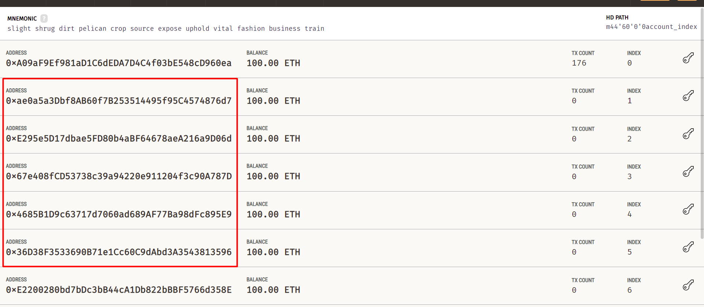

# UitFedSecAggre

## Setup system

### Requirement
- Truffle v5.11.5 (core: 5.11.5)
- [Ganache GUI v7.9.1](https://archive.trufflesuite.com/ganache/)
- Node v20.19.2
- Python 3.10.0

### Pip dependencies

Install necessary dependencies:
```bash
pip install -r prod.txt
```
This is an important step as we need to install the correct package versions.

### Set up SSL

Generate SSL certificates:
```bash
cd certificates && ./generate.sh
```

### Config IPFS to store file

1. Create a [Pinata](https://app.pinata.cloud) account and generate an API key with Admin permission
2. Copy `api_key_template.json`, create a new file named `api_key.json`, and add your API key inside

### Deploy blockchain contract

1. Open Ganache, create a new workspace, and add the full file path of `./Solidity/truffle-config.js` to the Truffle config in Ganache
2. In the project, navigate to the Solidity folder:
   ```bash
   cd ./Solidity
   truffle migrate --network development
   ```
   This command deploys the contract to Ganache
3. Test the connection using `testConnection.ipynb`, run the first 3 cells to see the 10 created accounts (with 0 tokens). This confirms the contract has been deployed successfully.

## Data setting
1. Extract the data folder, open `split5subtrain.ipynb` file, and edit `source_folder` with the file path of your data storage location
2. Run the first 4 cells. This will create a folder named `ClientData` with 5 sub-folders, each containing train and test datasets for a client

## Config parameters setting for each session run

### Server Configuration
Edit `server/config_training.json`:
- `fl_min_fit_clients`, `fl_min_evaluate_clients`, `fl_min_available_clients`: Update to the number of clients you want to run (e.g., set to 2 if you want to run with 2 clients)
- `data_dir_path`: Replace with the path to your dataset location

### Client Configuration
Edit `client/config_training.json`:
- `clt_iid_data_path`: Replace with the path to the `ClientData` folder created in the Data setting step

## Running system

1. Open Ganache and load your workspace
2. Ignore the first account and select the next accounts for your clients (e.g., the next 2 addresses if running 2 clients)
   

3. Add the selected addresses to the `client.json` file:
   ```json
   {
    "address":"0xae0a5a3Dbf8AB60f7B253514495f95C4574876d7"
   }
   ```
   Note: For this example, we're using 2 clients, but you can add more as needed.

4. Start the server and clients (you'll need 3 terminal windows):

   - Terminal 1 (Server):
     ```bash
     cd server
     python server_api.py
     ```

   - Terminal 2 (Client 1):
     ```bash
     cd client
     python client_api.py
     ```

   - Terminal 3 (Client 2):
     ```bash
     cd client
     python client_api2.py
     ```

   This will start the server and 2 clients that will connect to the server.

## Results

After a successful run:
1. A result folder will be uploaded to Pinata IPFS
2. Participating clients will be rewarded with tokens
3. To verify token rewards, run the cell labeled "#check all account balance" in `testConnection.ipynb`
4. You should see the client accounts that participated in the federated learning process now have a non-zero token balance
